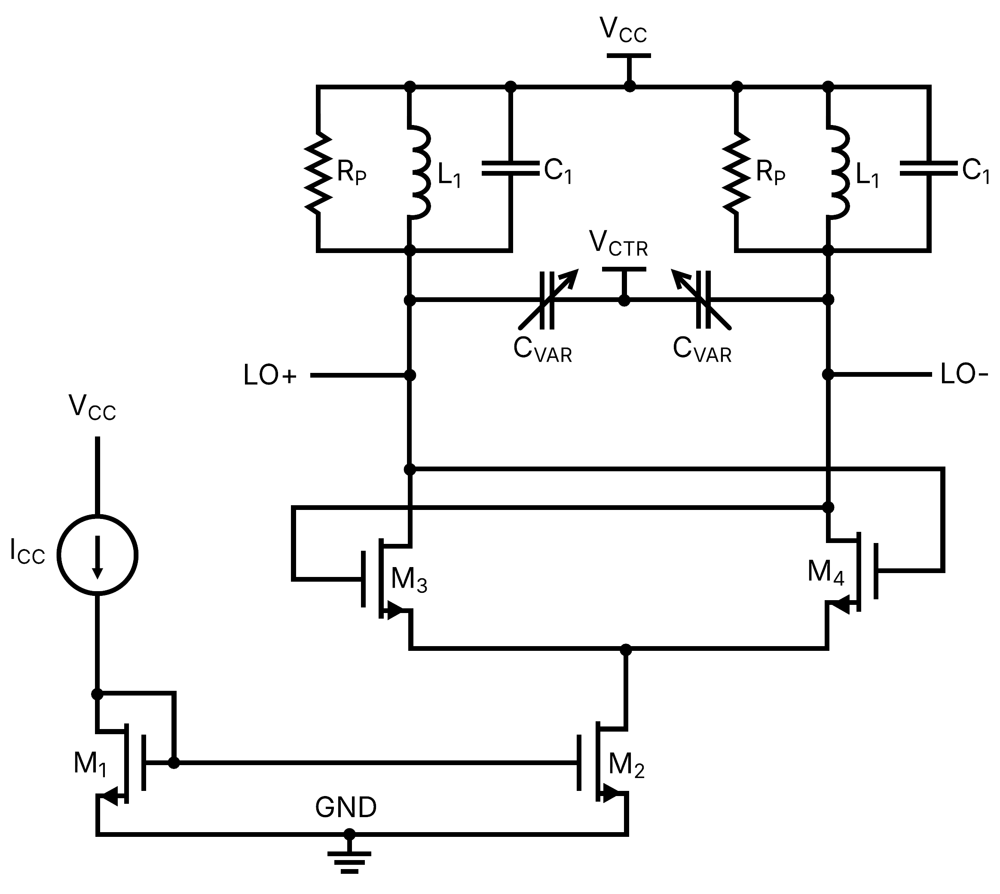

# Cryo_LCVCO

Projeto de VCO (Voltage Controlled Oscillator) para 2,45 GHz em SkyWater 130nm.

| Parâmetro          | Valor           |
| ------------------ | --------------- |
| Tecnologia         | SkyWater 130 nm |
| Frequência central | 2,45 GHz        |
| Faixa de sintonia  | 2,3–2,6 GHz     |
| Vctrl              | 0–1,8 V         |
| Alimentação        | 1,8 V           |

*Figura 1: Topologia do LCVCO cross-coupled com saída diferencial.*
